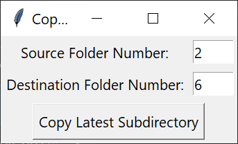
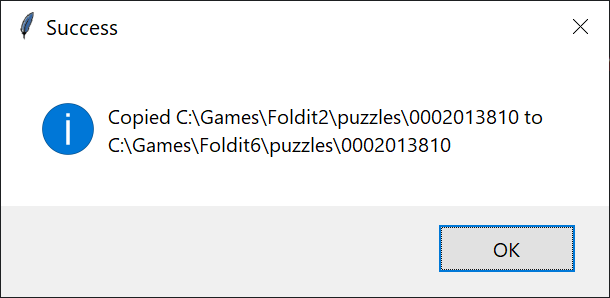

# FolditClient_CopyPuzzle
Simple tool to copy the save files of the active puzzle from one client to another. Clients are managed by their numbers as the program input.

How it works:
1) It Asks for two parameters which are the source and the destination folder name suffix. Let's suppose your input is '2' as the first one and '6' as the second one.
2) It copies the latest modified subdir (i.e. the currently active puzzle in client) from 'C:\Games\Foldit**2**\puzzles\'  to the destination folder 'C:\Games\Foldit**6**\puzzle\' replacing all the files if they exist.
   

Just change your Foldit clients paths names. By default it is:
foldit_path = "C:\Games\Foldit"

---
You need to install Python to run this program.
